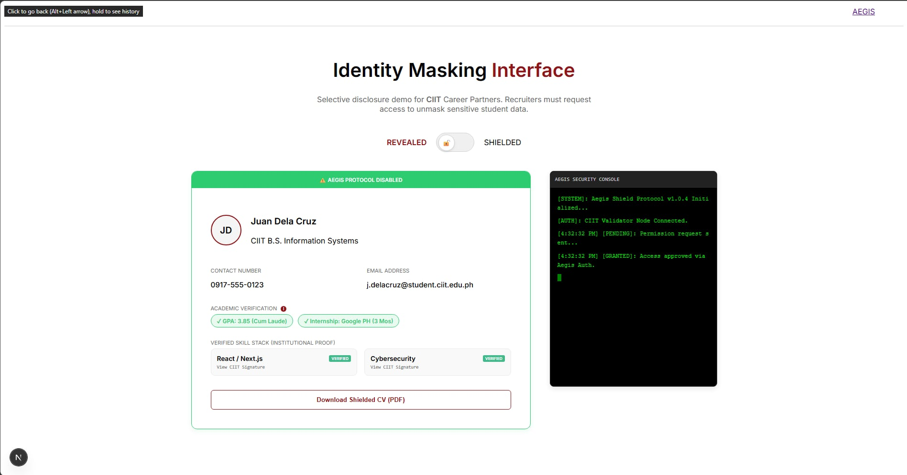
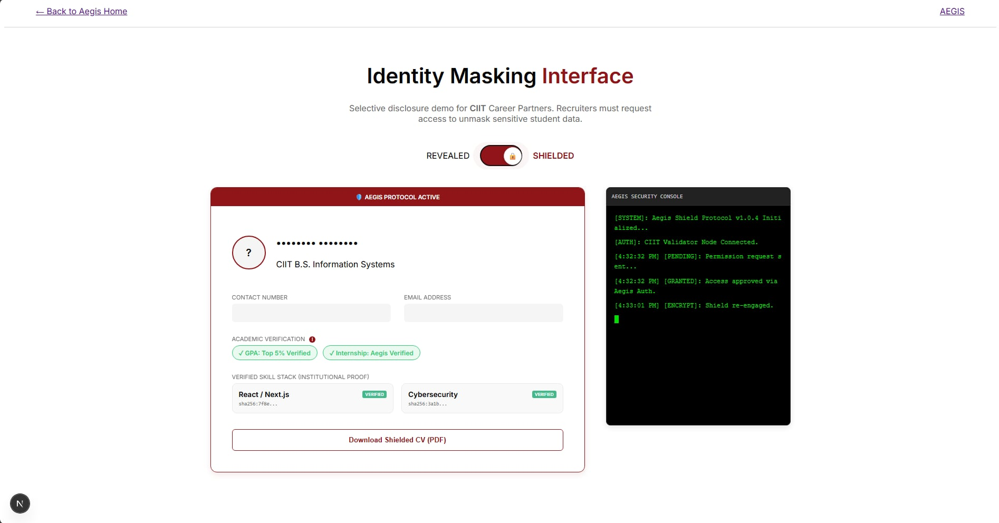
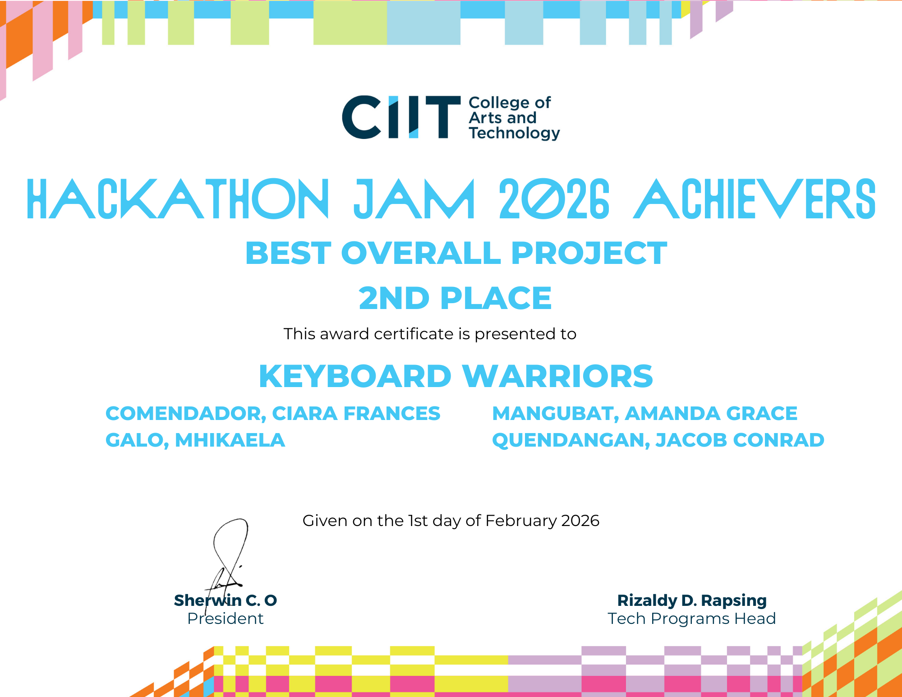

# Aegis: Institutional Verification Platform
**Event:** CIIT Institutional Hackathon  
**Award:** 2nd Place Overall  
**Role:** Technical Core Member (Backend & Frontend Logic)

## The Problem
Traditional verification systems often over-collect personal data, creating security liabilities. Aegis was engineered to verify **legitimacy, not identity**, ensuring organizations confirm eligibility without accessing or storing sensitive personal details.

## Technical Stack
* **Frontend:** Next.js 16 (React 19) with Tailwind CSS.
* **Backend:** Firebase Admin SDK (Node.js) for privileged operations.
* **Security:** Token-based "Masking" protocol with automatic TTL (Time-to-Live).
* **Deployment:** Firebase Hosting with custom rewrite logic for SPA routing.

## System Architecture & Logic

### 1. The Masking Protocol (`/lib/token.ts`)
The system follows a **Secure by Default** architecture. Instead of transmitting User IDs, it generates high-entropy, masked tokens (Format: `MX-XXXXXX-XXXXXX`).
* **Collision Resistance:** Server-side retry loop (5 attempts) to ensure token uniqueness.
* **Auto-Expiry:** Tokens default to a 10-minute validity window to prevent replay attacks.

### 2. Privacy-First API Layer (`/api/mask/`)
* **`create.js`**: Generates the token and maps it to a "Purpose" without linking to a persistent user profile.
* **`verify.js`**: A zero-exposure gateway. It returns a boolean `valid` status and the message **"Identity protected"**.
* **Audit Logging**: Every verification attempt is logged for institutional accountability.

### 3. Aegis Shielding Protocol (Live Demo)
The demo highlights the "Aegis Shield," which is active by default to protect sensitive information until an authorized request is granted.

#### Terminal Demo 1: Shielding Activated (Default State)

*The default state of the Aegis protocol: sensitive information is cryptographically shielded, and a secure verification token is issued.*

#### Terminal Demo 2: Shielding Deactivated

*The system state after an authorized permission request is granted, temporarily revealing specific data points for manual verification.*

## Achievement & Recognition
Our team, **Keyboard Warriors**, secured 2nd Place with a narrow margin of only 0.40 from the top spot, highlighting the high technical standard of our implementation.

