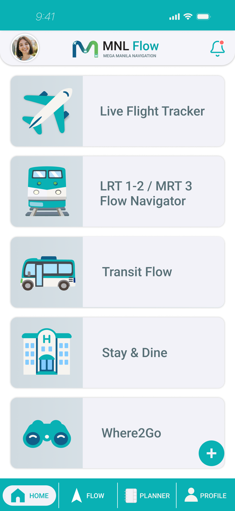
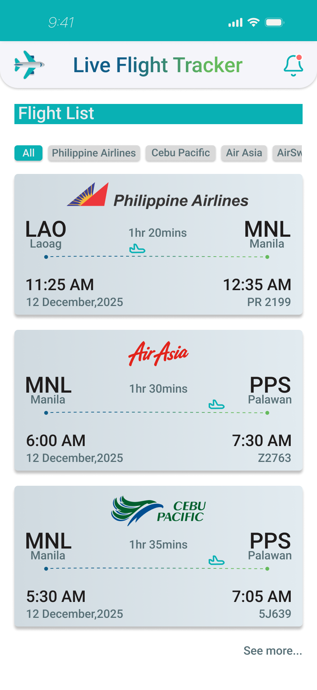
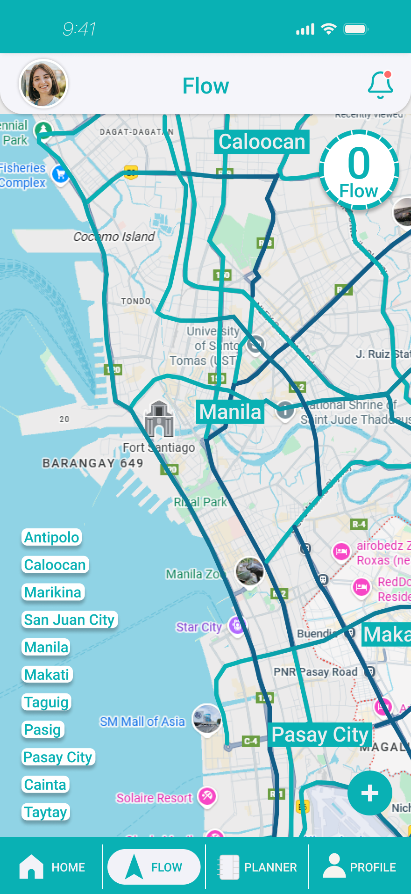
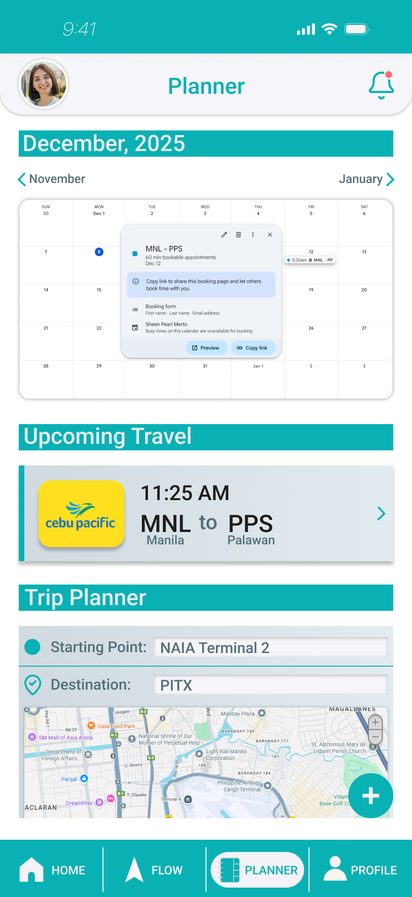
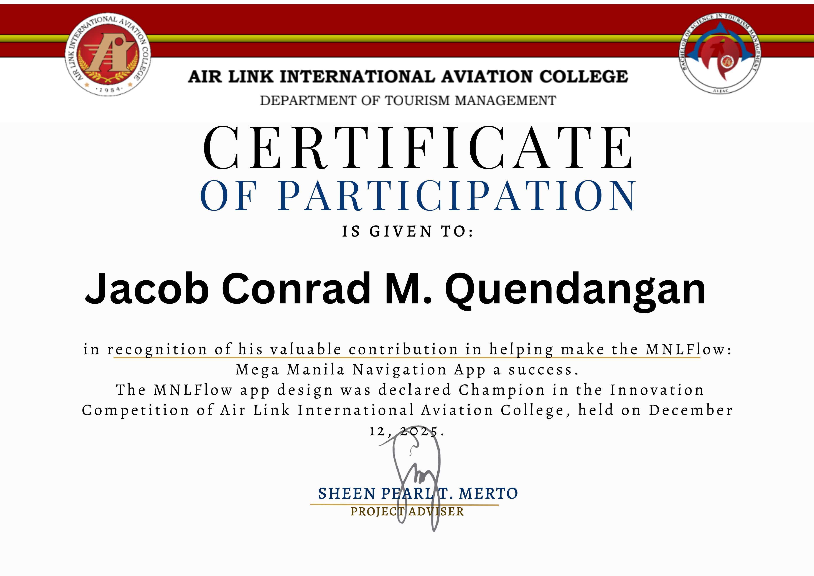

# MNLFlow: Integrated Transit & Tourism Architecture
**Award:** 1st Place Industry Choice – Annual Program Showcase  
**Tooling:** High-Fidelity **Figma** Prototype  
**Recognition:** Evaluated and endorsed by a Senior Representative from **Cebu Pacific**.

## Executive Summary
MNLFlow is a digital bridge designed to solve the "fragmented commute" crisis in Metro Manila. Developed from the IMRAD study *"MNLFlow as a Digital Tool for Sustainable Aviation,"* this prototype optimizes how tourists and professionals navigate the transition from aviation hubs (NAIA/ALIAC) to urban centers.

---

## Visual Interface Walkthrough

| **Main Hub** | **Live Flight Tracker** |
| :---: | :---: |
|  |  |
| *Unified Dashboard for all travel needs.* | *Status for all major & local carriers.* |

| **Transit Flow** | **Smart Planner** |
| :---: | :---: |
|  |  |
| *Real-time Mega Manila transit mapping.* | *Itinerary & destination mapping.* |

---

## Technical Pillars
* **MNLFlow Initiatives:** Integrated carbon-footprint tracking to encourage the use of mass transit and electric vehicles.
* **Heuristic UX Design:** Optimized for low cognitive load, ensuring travelers can navigate complex routes under high-stress conditions.
* **Tourism Integration:** Real-time surfacing of local sustainable businesses (e.g., Belmont Hotel's "Paghabi at Kape").

## Industry Recognition
MNLFlow was awarded **1st Place Industry Choice** due to its technical feasibility and its potential to solve the infrastructure gaps in the Philippine aviation and tourism sectors.

## Access & Documentation
The full **IMRAD Research Paper** and raw system logic are private institutional documents.
* [View Project Abstract (PDF)](./documentation/project_abstract.pdf)

**To request a full technical walkthrough or Figma link access, please contact the developer.**

---
**Developed by:** Jacob Conrad Quendangan  
**Institution:** ALIAC