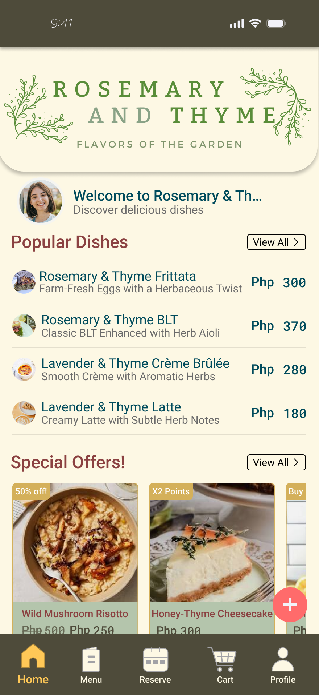
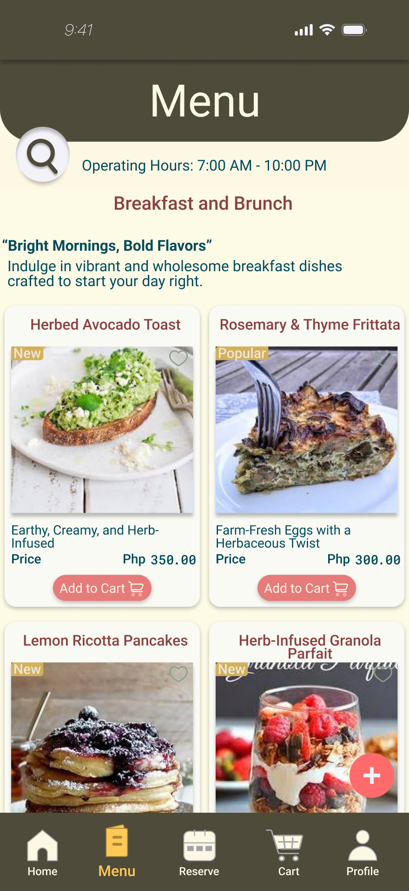
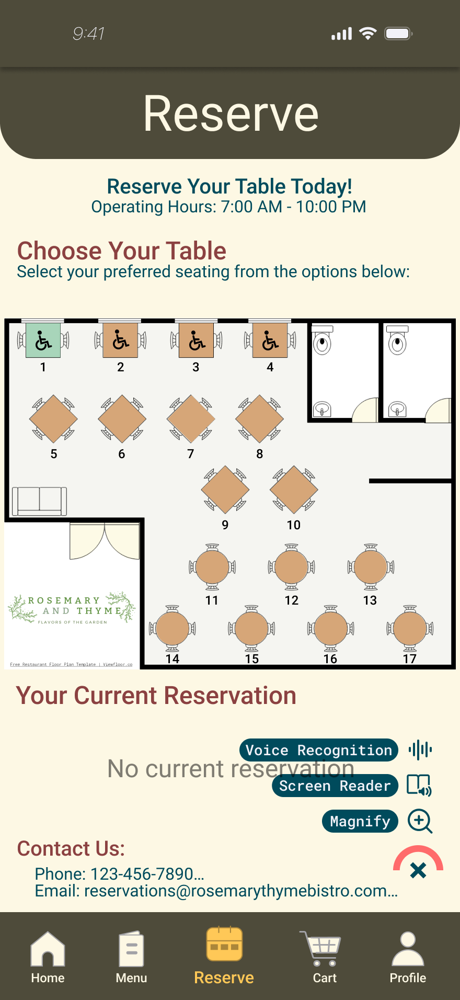
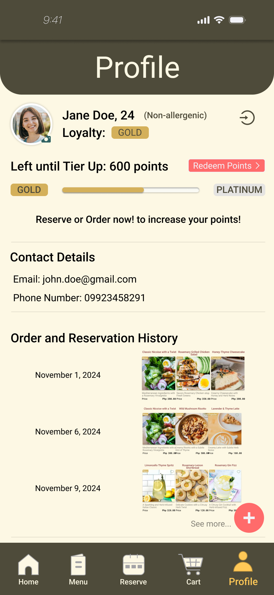

# Rosemary & Thyme: Flavors of the Garden
**Award:** Best Overall Prototype – HCI Hackathon 2024 
**Category:** Hospitality & User Experience (HCI)

## Interface Gallery
| Home Screen | Digital Menu | Reservation Flow |
| :---: | :---: | :---: |
|  |  |  |

### User Personalization

*The Loyalty & Profile system designed for the "Flavors of the Garden" rewards program.*

## Project Overview
Rosemary & Thyme is a high-fidelity restaurant ordering and reservation prototype designed to bridge the gap between fine dining and digital convenience. Developed for the HCI Hackathon at **CIIT College of Innovation and Integrated Technology**, this project won **Best Overall** for its adherence to user-centered design and seamless navigation.

## Key Features
* **Smart Reservation System:** A frictionless calendar interface (RESERVE_1 & RESERVE_2) that reduces booking abandonment.
* **Interactive Digital Menu:** Categorized navigation with high-quality visual hierarchy for popular dishes.
* **Loyalty Integration:** A dedicated Profile section to track points and past dining experiences.
* **Aesthetic Consistency:** A "Rosemary" palette (Deep Green and Cream) that reinforces a premium, organic brand identity.

## HCI Principles Applied
* **Fitts's Law:** Critical action buttons (Add to Cart, Reserve) are optimized for mobile thumb-reach.
* **Visibility of System Status:** Clear feedback loops throughout the reservation and ordering journey.
* **Recognition over Recall:** Using visual icons and familiar UI patterns so users spend less time learning and more time ordering.

## Interactive Prototype
[Click here to view the Rosemary & Thyme Figma Prototype](https://www.figma.com/proto/POcZDoavPIU7AC0DxBL7dB/HCIFO?node-id=283-4679&t=pPJ4IspMhfQnnKhC-1&scaling=scale-down&content-scaling=fixed&page-id=11%3A88&starting-point-node-id=283%3A4679)

---
*Developed as a winning entry for the HCI Hackathon | CIIT College of Innovation and Integrated Technology.*