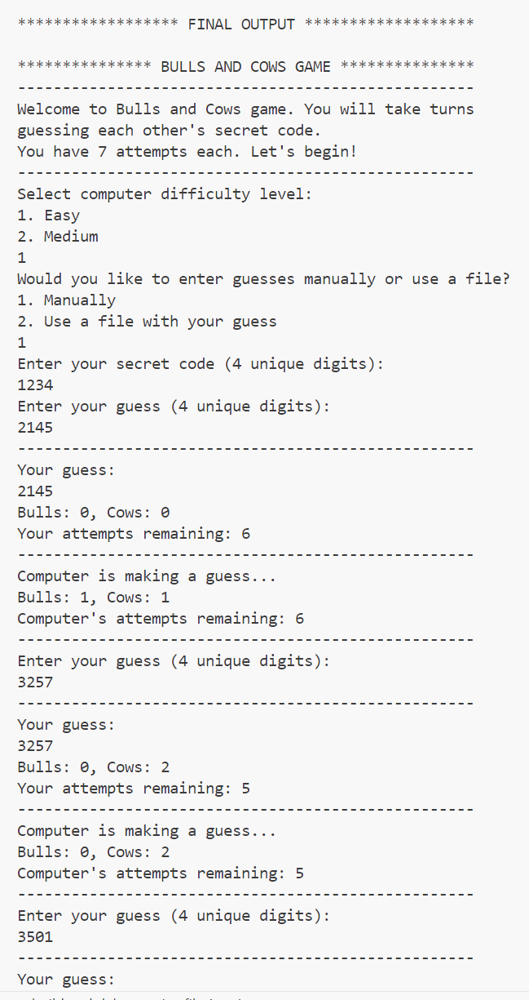
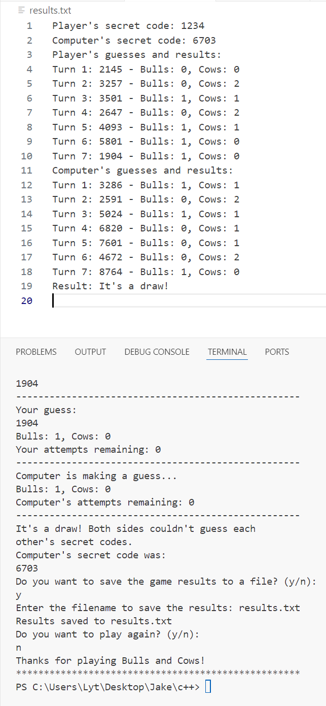

# Bulls and Cows: Algorithmic Logic Game
**Subject:** Data Structures and Algorithms (DSA)  
**Project Scope:** Game Logic, String Manipulation, and Search Algorithms  

## Project Overview
A classic code-breaking game implemented to demonstrate efficient algorithm design. The project focuses on a comparison engine that evaluates a secret 4-digit number against user input to return "Bulls" (exact matches) and "Cows" (digit matches in wrong positions).

## Algorithmic Implementation
* **Comparison Engine:** Optimized for linear time complexity $O(n)$ using single-pass iteration and frequency mapping to identify matches.
* **Unique Generation:** Utilizes a set-based shuffle algorithm to ensure the secret code contains no repeating digits, ensuring 100% uniqueness without redundant processing loops.
* **Input Validation:** Robust error handling and sanitization to prevent non-numeric or duplicate digit entries from breaking the game state.

## Technical Implementation (C++)
* **Data Structures:** Utilized `std::vector` for dynamic digit storage and `std::pair` for returning dual-value results (Bulls & Cows) from the logic engine.
* **Game State Management:** Implemented a turn-based loop with conditional difficulty scaling (Easy/Medium AI).
* **File I/O:** Integrated `std::ofstream` to generate session logs, capturing player/computer secret codes and turn-by-turn history.
* **Input Sanitization:** Used `std::limits` and `cin.clear()` to handle invalid user inputs and prevent buffer overflows.

## How to Play
1. **Setup Your Secret:** Upon starting, the player must enter a unique 4-digit secret code that the computer will attempt to guess.
2. **Choose Difficulty:** Select between **Easy** (Random AI) or **Medium** (Strategic AI that avoids repeating failed guesses).
3. **Make a Guess:** On your turn, enter a 4-digit number.
    * **Bull:** A digit is correct and in the correct position.
    * **Cow:** A digit is correct but in the wrong position.
4. **Win Condition:** The first player (or AI) to reach **4 Bulls** wins the match.
5. **Save Results:** After the game, you will be prompted to enter a filename to save the entire match history as a text file.

## Documentation
For a detailed technical analysis of the system architecture and complexity, refer to the following:
* [Algorithm Breakdown (PDF)](./Documentation/Algorithm_Breakdown.pdf)
* [Flowchart Logic (PDF)](./Documentation/Flowchart_Logic.pdf)

---
*Developed as a core project for Data Structures and Algorithms at CIIT College of Innovation and Integrated Technology.*