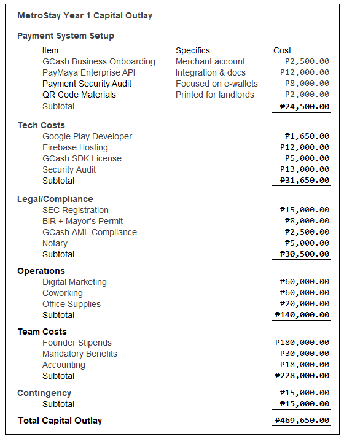

# MetroStay: Urban Accommodation MVP
Project Type: Technopreneurship 2 Final (Major Project)
Role: Lead Systems Analyst & Android Developer
Status: Functional Debug APK | 95.7% Projected Gross Margin

The Problem: Fragmented and unreliable property listings for students and young professionals in the Mega Manila region.
The Solution: A localized property-comparison engine that prioritizes proximity to transit, verified interior visuals, and price transparency.

## Functional MVP (Debug APK)
[Download the MetroStay Debug APK](App_Build/MetroStay_Debug.apk)
Experience the live application. This build showcases the core comparison engine and UI flow.

## Video Walkthrough
[Watch the Demo](Media/MetroStay_Demo.mp4)
A complete walkthrough of the user journey, from initial search to final property comparison.

## MVP Interface & Business Logic
| Branding & Vision | Property Discovery | User Favorites | Financial Modeling |
| :---: | :---: | :---: | :---: |
|  |  |  |  |

## Technopreneurship & Business Intelligence
This project involved a comprehensive 27-page Business Case and a data-driven financial model:

* Market Analysis: PESTEL and Porter’s Five Forces analysis of the National Capital Region (NCR) Proptech sector.
* Financial Viability: Projections showing a 95.7% Gross Profit Margin (PHP 522,518) based on a PHP 545,750 total revenue model.
* Capital Outlay: Detailed ₱469,650 initial budget covering GCash/PayMaya API integration, SEC registration, and BIR compliance.
* Scalability Logic: Projections scaling from 500 bookings in Year 1 to 3,000 bookings by Year 3.
* Strategic Roadmap: Proposed integration with local startup ecosystems such as the DTI Startup Grant Program and Founder Institute Manila.

## Key Features
* Granular Comparison: Filter condos and apartments by price, specific amenities, and interior quality.
* Shortlist Management: A "Favorites" system allowing users to save and compare high-interest properties.
* Localized Reach: Deep-dive focus on high-density districts (Cubao, Taft, Boni) near major transit hubs.
* Streamlined UI: A professional, high-performance interface designed for rapid decision-making on the go.

---
Developed for Technopreneurship 2 | CIIT College of Innovation and Integrated Technology.