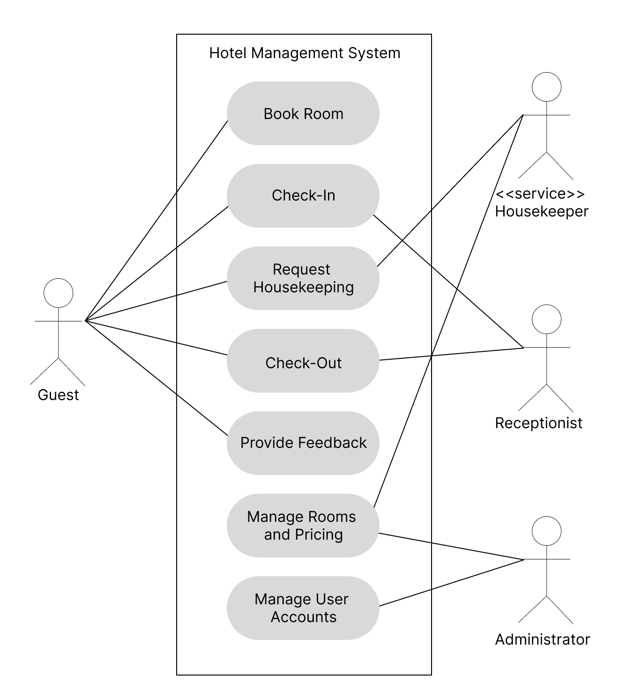
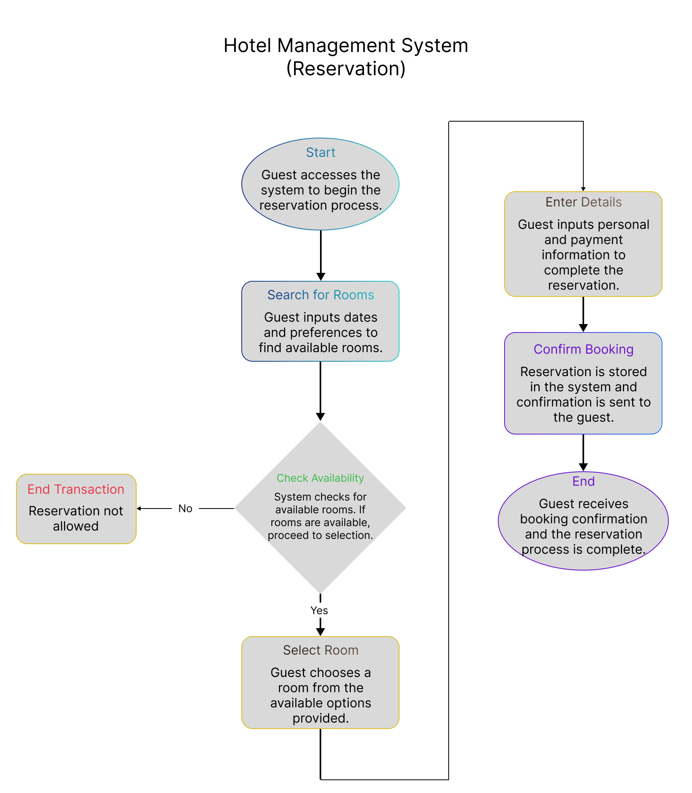
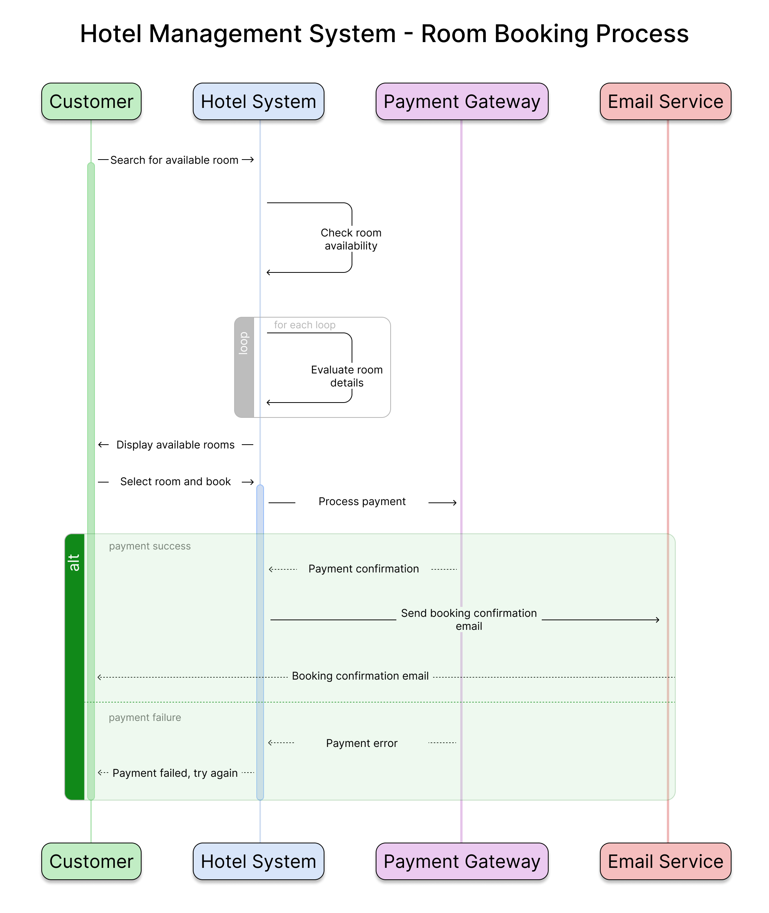
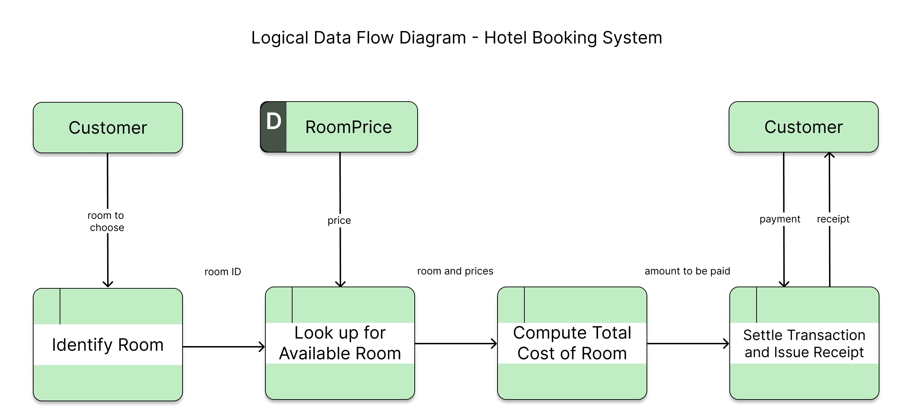

# Hotel Management System: Systems Analysis & Design (SAD)
**Subject:** Systems Analysis and Design  
**Project Scope:** Full-Scale System Architecture & UML Modeling  
**Tools:** Figma (High-Resolution Diagramming), MS Word/PDF (Documentation)

## 🎯 Project Overview
This project represents a deep dive into the architectural design of a Hotel Management System (HMS). I utilized the **Unified Modeling Language (UML)** and **Structured Analysis** to create a complete technical blueprint that defines how the system handles complex hospitality workflows, from data structures to real-time process execution.

## 🏗 Architectural Blueprints (Designed in Figma)
Using Figma to ensure high-fidelity and professional clarity, I developed a multi-layered architectural suite:

### 1. Behavioral Modeling (System Interaction)
* **Use Case Diagram:** Defines the functional boundaries and relationships between actors (Guest, Admin, Staff) and system goals.

* **Activity Diagram:** Maps the step-by-step control flow of the Check-In/Check-Out process, including decision points and parallel actions.

* **Sequence Diagram:** Visualizes the chronological interaction between objects (Customer -> System -> Database) during the reservation and payment lifecycle.

### 2. Structural Modeling (System Organization)
* **Class Diagram:** Details the static structure of the system, including attributes and methods for entities like `Room`, `Booking`, and `User`.

* **Package Diagram:** Illustrates the high-level organization of the software's subsystems (e.g., Billing Module, Inventory Module) and their dependencies.

### 3. Process Modeling (Data Flow)
* **Data Flow Diagram (Lvl 0):** Breaks down the internal data movement, specifically how guest information is transformed into invoices and room status updates.

## 📄 Documentation
The accompanying **Software Requirements Specification (SRS)** provides the technical foundation for these diagrams, detailing functional requirements, security protocols, and system performance benchmarks.

---
*Final Architectural Output for Systems Analysis and Design (BSIS).*