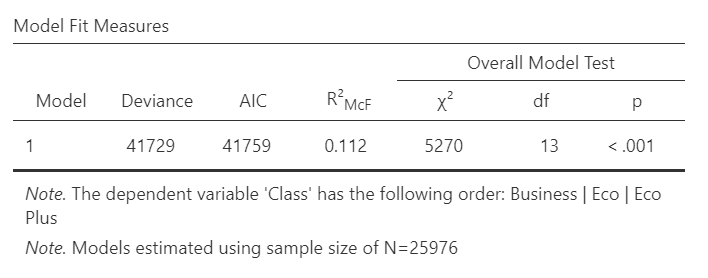
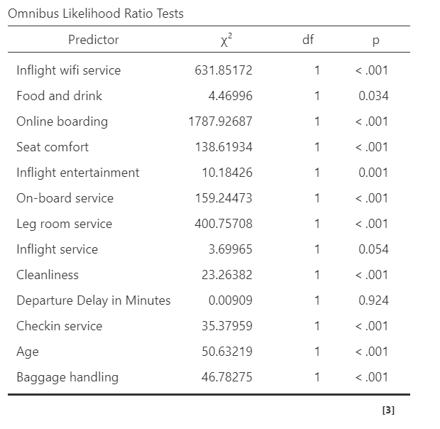
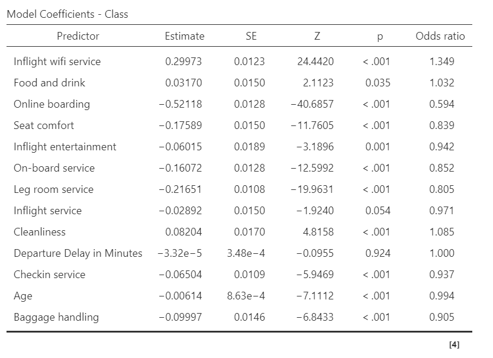

# Airline Service Quality: Predictive Regression Analysis
**Project Type:** STAT004 - Regression Analysis Final (Major Project)
**Tools Used:** jamovi | **Methodology:** Ordinal Logistic Regression
**Status:** Research Model | 120,000+ Record Dataset

**The Problem:** Determining the specific service predictors that influence a passenger's choice between Economy, Eco Plus, and Business class is difficult without a data-driven model.
**The Solution:** An Ordinal Logistic Regression model that identifies "Premium Drivers" and "Basic Drivers" to optimize airline service strategy and resource allocation.

## Statistical Methodology
Using a dataset of over 120,000 passenger records, I performed an **Ordinal Logistic Regression** to identify the strongest predictors for passenger flight class selection.

* **Primary Predictors:** Identified In-flight Wi-Fi, Food & Drink, and Cleanliness as the "Premium Drivers."
* **The Expectation Paradox:** Discovered that basic features like Seat Comfort are inversely correlated with higher class choice, as they primarily exceed the expectations of Economy passengers.

## Statistical Model Output
| Model Fit Measures | Omnibus Likelihood Ratio Test | Model Coefficients |
| :---: | :---: | :---: |
|  |  |  |

## Data Availability
* **Analysis File:** `Flight_Class_Regression_Analysis.omv` (Includes all statistical models and computed variables).
* **Raw Dataset:** `Airline_Service_Quality_Dataset.csv` (Original 120,000+ record dataset for independent verification).

---
*Developed for STAT004 | CIIT College of Arts and Technology.*