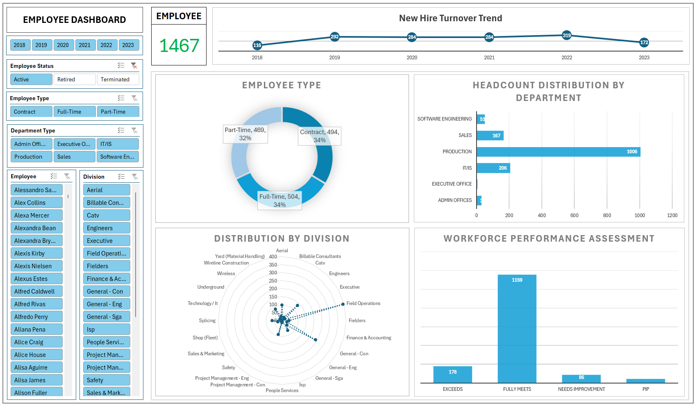
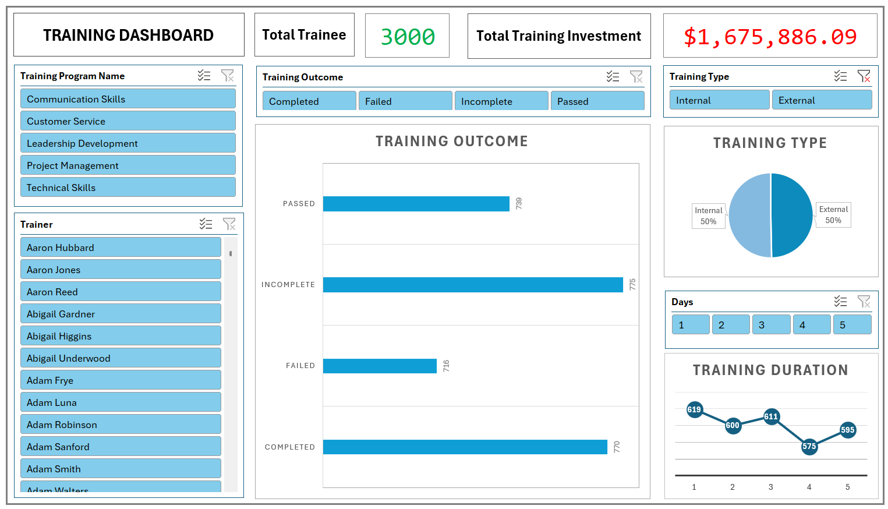
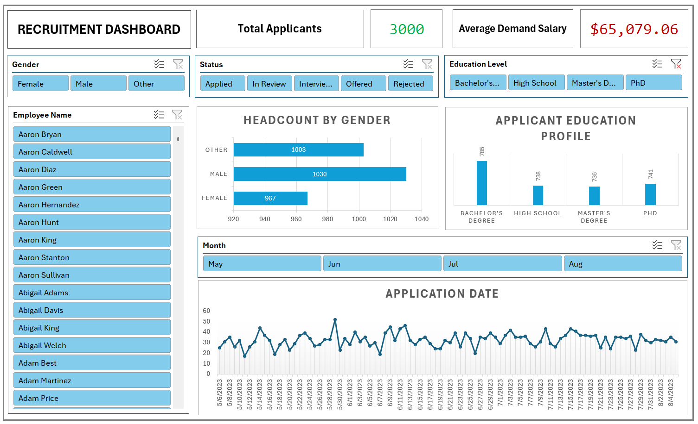
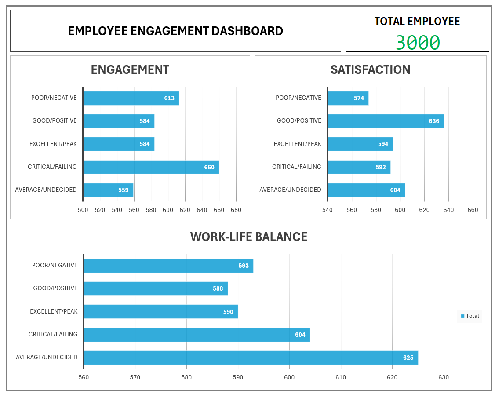

# Corporate HR Intelligence: Business Intelligence Dashboard Suite
**Subject:** IS218 - Business Intelligence 
**Project Scope:** Visual Analytics & Dashboard Development  
**Tools:** MS Excel (Pivot Tables, Slicers, Data Visualization, Interactive Reporting)

## Project Focus: Visual Analytics
In this class-wide Business Intelligence initiative, my group was responsible for the **Dashboarding and Visual Analytics** phase. Using pre-processed HR data, we designed and developed an interactive dashboard suite in Excel to translate complex datasets into actionable business insights.

## Interactive Dashboard Suite
I developed four specialized dashboards, each providing targeted KPIs and visual trends for different organizational programs:

### 1. Workforce & Headcount Dashboard
* **Function:** Monitoring organizational stability and departmental composition.
* **Key Visuals:** Headcount distribution across 10 Business Units (BPC, CCDR, NEL, etc.) and active vs. terminated employee status tracking.

### 2. Training & Development Dashboard
* **Function:** Visualizing educational ROI and program participation.
* **Key Visuals:** A high-level overview of the **$1.67M training investment**, tracking completion rates (Passed vs. Incomplete) and program popularity.

### 3. Recruitment Analytics Dashboard
* **Function:** Analyzing the talent acquisition pipeline and applicant demographics.
* **Key Visuals:** Correlation heatmaps between Education Levels and desired salary expectations across 3,000 applicants.

### 4. Employee Engagement & Wellness Dashboard
* **Function:** Mapping employee morale and work-life balance.
* **Key Visuals:** Scoring distributions for Job Satisfaction and Engagement, specifically highlighting the "Critical/Failing" segments.

## Technical Features
* **Dynamic Slicers:** Integrated multi-dimensional filters (Gender, Department, Pay Zone) allowing users to drill down into specific data segments.
* **Visual Consistency:** Used a unified color palette (Teal/Green/White) and minimalist layout for professional-grade readability.
* **Pivot Integration:** Built all visualizations on a robust Pivot Table backend to ensure data remained synchronized and easily updatable.

---
*Final Visual Output for Business Intelligence.*