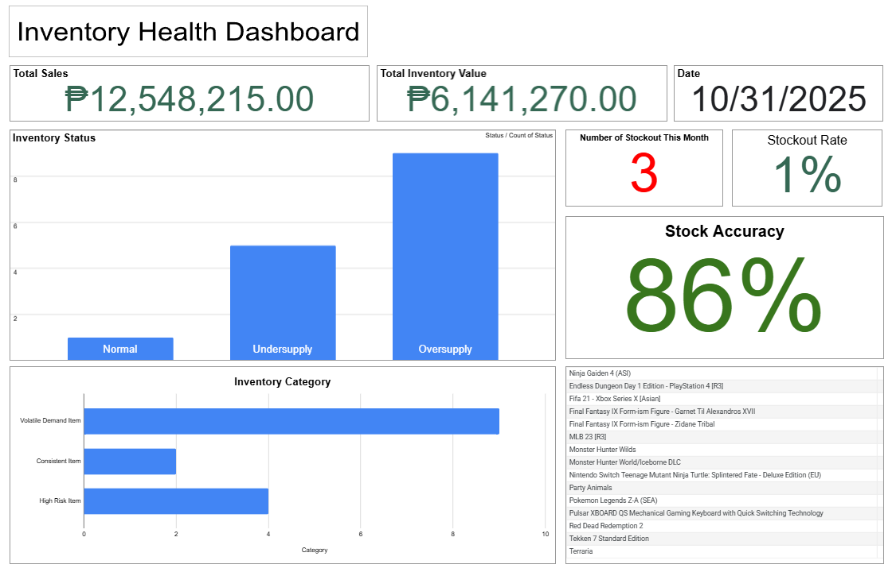

# SCM Inventory Management: Automated Logic & Dashboard
**Project Type:** Supply Chain Management (SCM) Coursework  
**Sector:** Gaming & Collectibles Retail Case Study  
**Tools:** Google Sheets (Pivot Tables, Advanced Logical Formulas, Data Visualization)

---

## Live Interactive Dashboard
### **[Click Here to View the Live Google Sheets System](https://docs.google.com/spreadsheets/d/1pi-65n5sWiRS8G9-ZpBcOv6OWJWOTtqhP-28oUdRzeY/edit?usp=sharing)**
*Experience the automated reorder logic, inventory segmentation, and real-time KPI tracking for high-value retail.*

---

## Inventory Health Monitoring
The dashboard provides executive-level visibility into supply chain performance, managing a **₱12.5M Sales operation**.

### Key Performance Indicators (KPIs):
* **Stock Accuracy (86%):** A measure of data integrity, highlighting the variance between physical stock and system records.
* **Stockout Count (4):** A critical KPI for service levels, identifying missed revenue opportunities and supply chain gaps.
* **Inventory Status Distribution:** Real-time visualization of **Normal, Undersupply, and Oversupply** levels to drive procurement priorities.

---

## SCM Technical Framework
The system automates the procurement cycle using industry-standard inventory models:
* **Reorder Point (ROP) Model:** Uses the formula $ROP = (Daily Demand \times Lead Time) + Safety Stock$ to determine the exact moment a purchase order should be triggered.
* **Inventory Status Mapping:** Automatically categorizes 15+ SKUs based on ROP thresholds.
* **ABC/Category Segmentation:** * **Volatile Demand:** Items with high variability (e.g., *Monster Hunter Wilds*, *Ninja Gaiden 4*).
    * **Consistent:** Stable, predictable sellers (e.g., *Fifa 21*, *MLB 23*).
    * **High Risk:** High-value collectibles (e.g., *Final Fantasy IX Form-ism Figures*) requiring low-tolerance stock control.

## Risk Mitigation & Analysis
The project includes a strategic analysis of common SCM failures:
* **Stockout Prevention:** Balancing safety stock levels against demand surges.
* **Overstock Reduction:** Identifying "Oversupply" items to minimize carrying costs and free up working capital.
* **Waste Management:** Strategies for managing obsolescence in fast-moving retail environments.

---
*Developed for the SCM Subject | Data Analytics & Dashboards Category.*