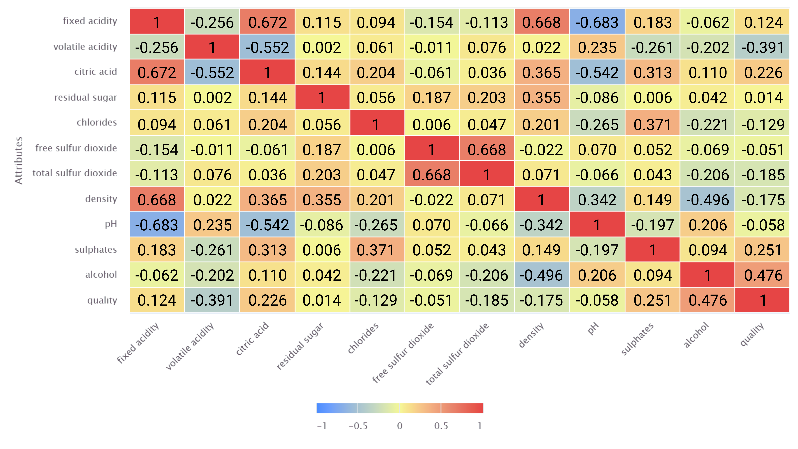
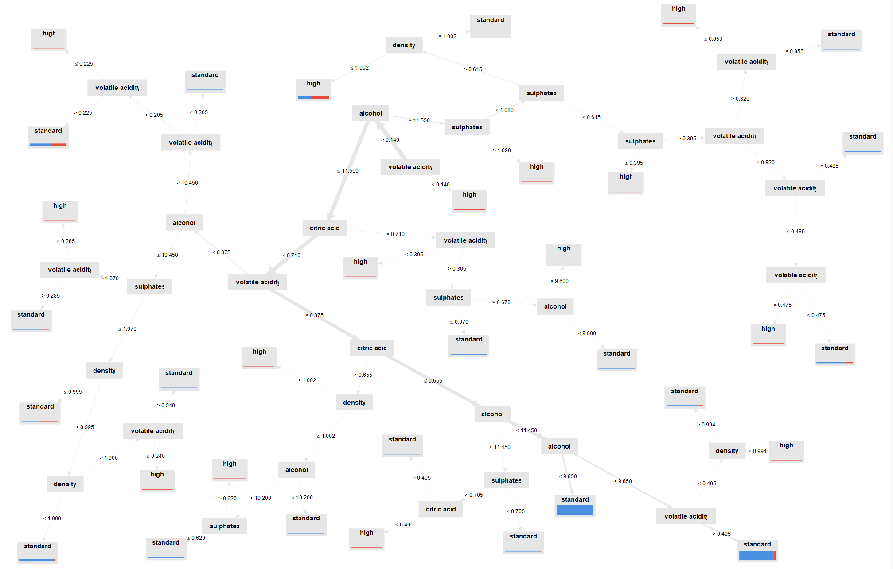

# Wine Quality: Predictive Modeling and Data Mining
**Project Type:** EMC005 - Datamining Research Project
**Tools Used:** Altair AI Studio | **Methodology:** Decision Tree, Logistic Regression, K-Means Clustering
**Status:** Research Model | 84.24% Accuracy Achieved

**The Problem:** Manually assessing wine quality through professional tasters is costly and subjective, making it difficult for producers to maintain consistent standards at scale.
**The Solution:** A multi-method predictive model developed in Altair AI Studio that evaluates physicochemical properties to classify wine quality, reducing reliance on manual sensory evaluation.

## Statistical Methodology
This research compared three data mining methods across two validation strategies (Split Data vs. Cross-Validation) to ensure model stability and accuracy:

* **Decision Tree:** Used to establish a clear classification hierarchy and identify thresholds for "High Quality" vs. "Standard" wine.
* **Logistic Regression:** Applied to determine the probability of a wine batch meeting quality standards based on chemical inputs.
* **K-Means Clustering:** Implemented to segment the dataset into distinct clusters, uncovering hidden patterns in wine composition.
* **Validation Strategy:** Cross-Validation was selected as the superior method, as it improved performance across 3 out of 4 key metrics.

## Statistical Model Output
| Correlations Heatmap | Decision Tree Logic | Model Performance |
| :---: | :---: | :---: |
|  |  |  |

## Performance Comparison
The following table demonstrates the performance gains achieved by moving from a standard 60/20/20 Split to a Cross-Validation approach:

| Performance Vector | Split Data Method | Cross Validation Method |
| :--- | :--- | :--- |
| **Accuracy** | 82.50% | **84.24%** |
| **Precision** | 41.10% | **44.68%** |
| **Recall** | **69.77%** | 67.74% |
| **AUC** | 84.8% | **86.2%** |

## Data Availability
* **Analysis Processes:** Includes five `.rmp` files covering Decision Tree, Logistic Regression (Split/Cross), and K-Means.
* **Raw Dataset:** `Wine_Quality_Dataset.csv` (Physicochemical attributes of Vinho Verde wine).
* **Technical Report:** `Datamining_Final_Report.pdf` (The full 28-page research paper detailing feature selection and performance evaluation).

## Dataset Citation
The dataset used in this research is sourced from the **UCI Machine Learning Repository**:
*Cortez, P., Cerdeira, A., Almeida, F., Matos, T., & Reis, J. (2009). Modeling wine preferences by data mining from physicochemical properties. In Decision Support Systems, Elsevier, 47(4):547-553.*

---
*Developed for EMC005 | CIIT College of Innovation and Integrated Technology.*